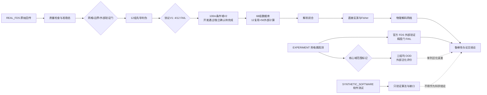

# 论文方法章节与数据流模板

本文件只固定章节、数据来源标签和追溯字段，不包含正式结果或结论。每个结果段落必须
同时填写：`data_source`、`subset`、`model_or_data_version`、`analysis_script`、
`metric_or_figure`、`evidence_path`。

## 方法章节骨架

1. 问题定义与温度变量纪律：总 HRR `Q`、火源位置 `x_f`、顶棚中心线气体温升。
2. FDS 平台：几何、材料、燃烧、网格/边界/外部验证及准稳态判据。
3. 先导结构判伪：保留协议 V1 的 `4/12 FAIL`；说明为何改用 100 m 条件域
   V2、单侧参数掩码、强风/下游域删失和峰值 Bootstrap。
4. 准稳态数据库：固定 `L×W×H=100×10×5 m`、`dx=0.25 m`、测量区
   `x=15--85 m`；50 开发、12 封存独立测试、6 偏移及完整工况隔离。
5. 有效输运解析核与闭合：逐工况提取、两阶段拟合、工况 Bootstrap。
6. 可辨识性与直接反演：灵敏度、Fisher、布局、粗搜与多初值精化。
7. 可微物理解码：集合编码器、约束输出、重建损失和四模型对照。
8. 鲁棒性、不确定性、外部反演与异常残差。

## 数据流与决策门



## 结果段落追溯块

```text
结论/图表 ID：
data_source：REAL_FDS | EXPERIMENT | SYNTHETIC_SOFTWARE
subset：
model_or_data_version：
analysis_script：
metric_or_figure：
evidence_path：
decision_status：WAITING | PASS | FAIL | REVIEW
限制与不可推广范围：
protocol_version：100M_CONDITIONAL_DOMAIN_V2
domain_censor_state：
parameter_target_mask：
applicability_status：IN_DOMAIN_100M_CONDITIONAL | OOD_EXPLORATORY | APPLICABILITY_UNDETERMINED
```

## 写作纪律

- `SYNTHETIC_SOFTWARE` 只进入方法验证，不进入正式精度或物理结论。
- 热电偶响应温度与主体气体温度分开报告，除非已有明确响应模型。
- Arup/CSTB/IFAB 的几何和网格均越出 V2 核心域；允许完整报告端到端泛化
  误差和模型失配，但与核心域独立试验精度分栏呈现。
- 独立测试在公式、阈值和超参数冻结后一次性解封。
- 不把 V1 的失败证据删除或改写为 V2 通过；V2 必须以封存独立测试确认。
- 不把 100 m 条件域结果表述为洞口独立、网格收敛或长隧道通用结论。
- 所有等待字段保持空白或 `WAITING_*`，不得用占位数字、插值或预期值填充。
